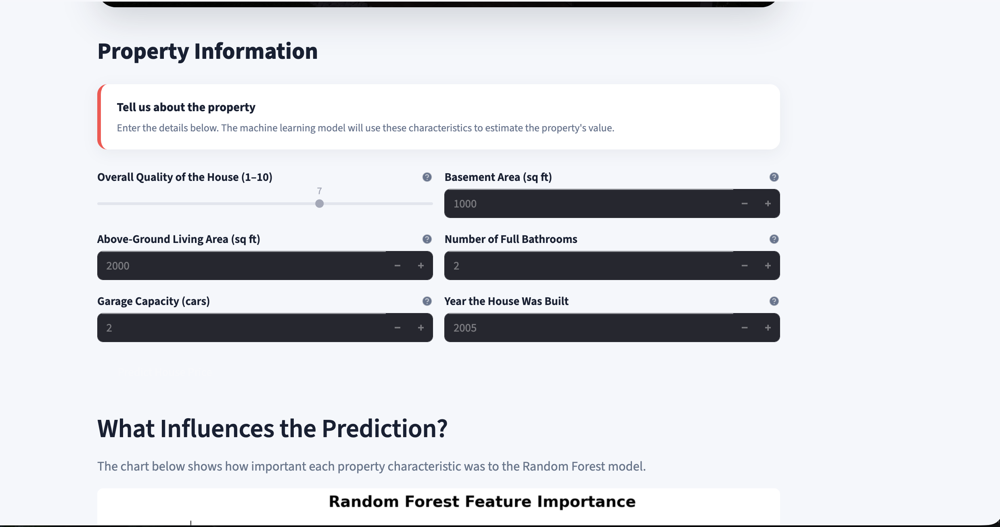
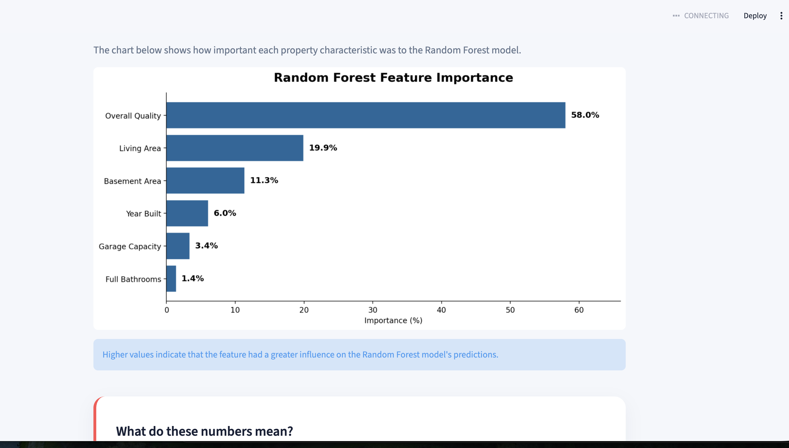
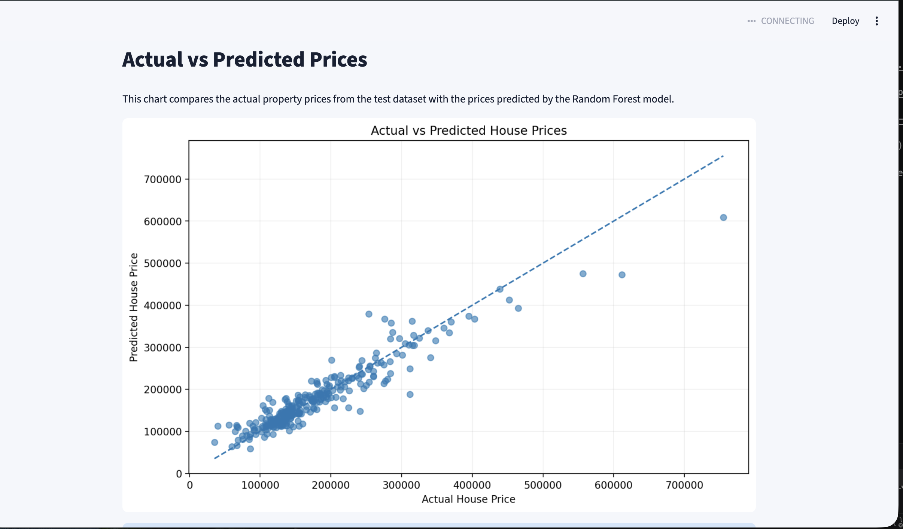
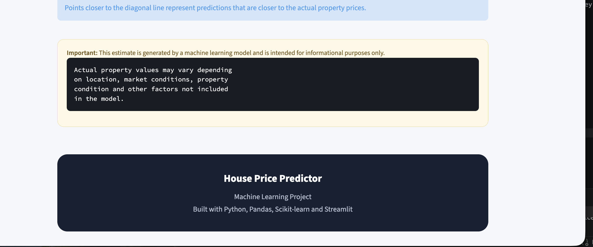

# 🏠 House Price Predictor

### Machine Learning Web Application for Residential Property Price Estimation

An interactive machine learning application that estimates residential property prices based on key property characteristics using a Random Forest Regression model.

---

## 📸 Application Preview

---

## 🚀 Live Demo

🔗 **Try the application:**  
https://house-price-predictor2.streamlit.app/
---

## 📌 Overview

The **House Price Predictor** is an end-to-end machine learning project designed to estimate the potential market value of a residential property.

Users provide six important property characteristics, and the application generates an estimated property value along with additional insights about the prediction.

The application combines:

- Machine learning
- Data preprocessing
- Model evaluation
- Feature importance analysis
- Data visualization
- Interactive web development
- PDF report generation

The project demonstrates how a trained machine learning model can be transformed into a practical user-facing application.

---

## 🎯 Project Objective

The goal of this project is to build an interactive machine learning system capable of estimating house prices from selected property characteristics.

Rather than presenting a machine learning model as a standalone Python script, the project integrates the model into a complete web application where users can interact with the prediction system and understand the factors influencing the result.

---

## ✨ Key Features

- 🏠 House price prediction
- 🤖 Random Forest Regression
- 📊 Model performance evaluation
- 📈 Feature importance analysis
- 📉 Actual vs Predicted price visualization
- 💰 Estimated property value range
- 📋 Property summary
- 📄 Downloadable PDF prediction report
- 🎨 Custom CSS user interface
- 🔍 Explanation of model predictions
- 🖼️ Automated house-image carousel

---

## 🤖 Machine Learning

Two regression models were evaluated during development:

### 1. Linear Regression

Linear Regression was used as the baseline model.

### 2. Random Forest Regression

The Random Forest Regressor was selected as the final model because it provided stronger predictive performance.

### Model Configuration

- Algorithm: Random Forest Regression
- Number of estimators: 200
- Random state: 42
- Parallel processing: Enabled

---

## 📊 Features Used by the Model

The final model uses six property characteristics:

| Feature | Description |
|---|---|
| OverallQual | Overall material and finish quality of the house |
| GrLivArea | Above-ground living area in square feet |
| GarageCars | Garage capacity measured by number of cars |
| TotalBsmtSF | Total basement area in square feet |
| FullBath | Number of full bathrooms |
| YearBuilt | Original construction year |

---

## 📈 Model Performance

The Random Forest model was evaluated using unseen test data.

| Metric | Result |
|---|---:|
| R² Score | 88.9% |
| MAE | $19,103 |
| RMSE | $29,191 |

### Understanding the Results

**R² Score — 88.9%**

The model explains approximately 88.9% of the variation in house prices within the test dataset.

**MAE — $19,103**

The model's predictions differ from the actual property prices by approximately $19,103 on average.

**RMSE — $29,191**

RMSE places greater emphasis on larger prediction errors and provides an additional measure of prediction accuracy.

---

## 🔍 Feature Importance

The Random Forest model identified the following feature importance:

| Feature | Importance |
|---|---:|
| Overall Quality | 58.0% |
| Living Area | 19.9% |
| Basement Area | 11.3% |
| Year Built | 6.0% |
| Garage Capacity | 3.4% |
| Full Bathrooms | 1.4% |

### Key Insight

**Overall Quality** is the strongest contributor to the model's predictions, accounting for approximately **58%** of the total feature importance.

**Living Area** is the second most influential feature at approximately **19.9%**.

This indicates that the model relies considerably more on the overall quality and size of the property than on the number of bathrooms or garage capacity.

---

## 📉 Actual vs Predicted Prices

The application includes an Actual vs Predicted visualization based on the model's test-set predictions.

The chart compares:

- Actual property prices
- Random Forest predicted prices

Predictions closer to the ideal diagonal line indicate stronger agreement between predicted and actual prices.

---

## 🖥️ Application Workflow

The application follows this workflow:

User Input
↓
Property Characteristics
↓
Data Preparation
↓
Random Forest Model
↓
Price Prediction
↓
Prediction Range
↓
Feature Importance
↓
Model Performance
↓
PDF Prediction Report

---

## 🛠️ Technology Stack

### Programming

- Python

### Machine Learning

- Scikit-learn
- Random Forest Regression
- Linear Regression

### Data Processing

- Pandas
- NumPy

### Visualization

- Matplotlib

### Web Application

- Streamlit
- HTML
- CSS

### PDF Generation

- ReportLab

### Model Persistence

- Joblib

### Development & Version Control

- Visual Studio Code
- Git
- GitHub

---

## 📂 Project Structure

House-Price-Predictor/
│
├── data/
│   └── train.csv
│
├── images/
│   ├── house1.jpg
│   ├── house2.jpg
│   ├── house3.jpg
│   ├── house4.jpg
│   ├── house5.jpg
│   └── house-price-predictor.png
│
├── styles/
│   └── style.css
│
├── app.py
├── model.py
├── predict.py
├── requirements.txt
├── README.md
└── .gitignore

The trained house_price_model.pkl file is excluded from Git tracking through .gitignore.

---

## ⚙️ Installation

### 1. Clone the repository

git clone https://github.com/YOUR-USERNAME/House-Price-Predictor.git

### 2. Navigate into the project

cd House-Price-Predictor

### 3. Install dependencies

pip install -r requirements.txt

---

## ▶️ Run the Application

Start the Streamlit application:

streamlit run app.py

The application will open in your web browser.

---

## 🧠 Train the Model

To retrain the Random Forest model:

python model.py

The training process:

1. Loads the housing dataset.
2. Selects the six model features.
3. Handles missing values.
4. Splits the dataset into training and testing data.
5. Trains Linear Regression.
6. Trains Random Forest Regression.
7. Evaluates model performance.
8. Calculates feature importance.
9. Saves the trained Random Forest model.

The generated model file is:

house_price_model.pkl

The model file is intentionally excluded from Git tracking.

---

## 📄 PDF Prediction Report

The application provides a downloadable prediction report containing relevant information about the generated estimate.

The report can be used to save or share prediction results.

---

## 💡 What I Learned

This project provided practical experience with:

- Building regression models
- Comparing machine learning algorithms
- Selecting relevant features
- Handling missing data
- Splitting data into training and testing sets
- Evaluating model performance
- Interpreting feature importance
- Building interactive Streamlit applications
- Integrating machine learning into a user interface
- Creating downloadable PDF reports
- Separating application logic from CSS styling
- Managing projects with Git and GitHub

---

## 🔮 Future Improvements

Potential future improvements include:

- Real-time property market data integration
- Additional property features
- Hyperparameter optimization
- XGBoost model comparison
- SHAP-based model explainability
- Property location analysis
- Database integration
- Cloud deployment
- User authentication
- Automated model retraining

---

## ⚠️ Disclaimer

This application provides **machine-learning-based estimates for informational and educational purposes only**.

The predictions should not be considered professional property appraisals, financial advice, or guaranteed market values.

Actual property values may vary depending on location, market conditions, property condition, neighborhood characteristics, and other factors not included in the model.

---

## 👨‍💻 Author

### Okpalaezennia Augustine

**AI/ML • Python • Software Development • IT**

Building practical machine learning and AI-powered applications that solve real-world problems.

---

## ⭐ Support

If you find this project useful or interesting, consider giving the repository a ⭐ on GitHub.

---